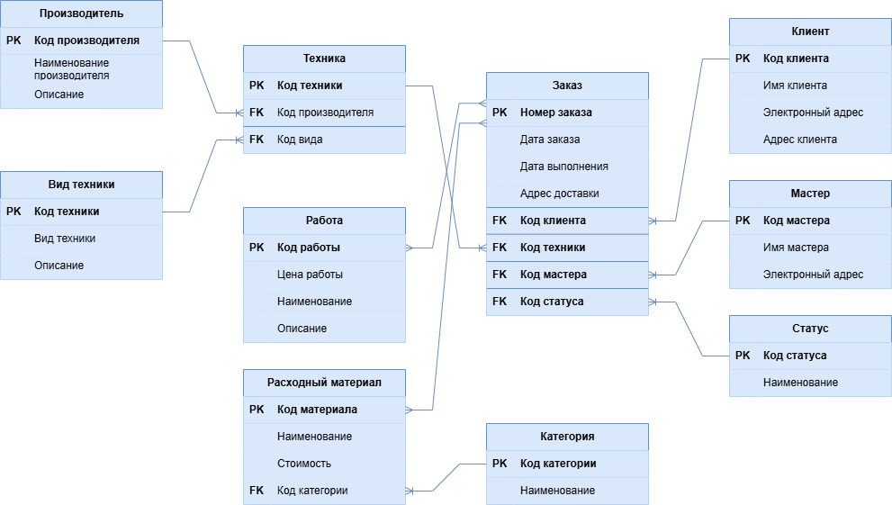
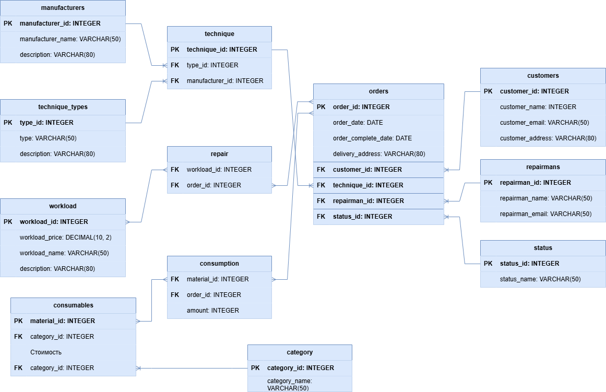

# <b>Проектирование и разработка базы данных сервисного центра</b>

Проект представляет собой полнофункциональную базу данных для автоматизации работы сервисного центра по ремонту компьютерной техники и электроники. Разработанная система обеспечивает полный цикл управления заказами - от приема техники до выдачи клиенту с детальным учетом всех операций, материалов и финансовых расчетов.

<p align="center">
  
  
</p>

## <b>Навигация</b>
1. [Описание проекта](#проектирование-и-разработка-базы-данных-сервисного-центра)
2. [Модель данных](#модель-данных)
3. [Установка](#установка)
4. [Программируемые объекты](#программируемые-объекты)

## <b>Модель данных</b>

Проектируемая база данных должна содержать информацию о оформленных в сервисном центре заказах, информацию о расходах на ремонт конкретной единицы техники и информацию о клиенте, который оформляет заказ. Для каждого <b>клиента</b> хранится такая информация, как имя и электронный адрес. Аналогичная информация хранится для <b>мастера</b>. За <b>техникой</b> закреплены ее <b>производитель</b> и <b>вид</b>, который определяет, конкретно каким устройством она является (например, ПК, мобильный телефон и т.д.). <b>Работа</b> по конкретной технике содержит наименование конкретных проводимых над техникой операций (например, замена дисплея, распайка дополнительного слота под RAM и т.д.). Также хранится <b>расходный материал</b> относительно каждой работы, проведенной над техникой. Сводная таблица заказ хранит в себе основную информацию по заказу.

На основе предложенной выше функциональной модели была разработана модель данных, логическая и физическая схемы которой представлены на рисунках ниже.
<p align="center">
  
</p>
<p align="center">
  Рисунок 1. Логическая модель данных
</p>
<p align="center">
  
</p>
<p align="center">
  Рисунок 2. Физическая модель данных
</p>

## <b>Установка</b>

Перед началом установки убедитесь, что на вашей системе установлены:

| Компонент | Минимальная версия | Рекомендуемая версия | Проверка установки |
|-----------|-------------------|----------------------|-------------------|
| **MySQL Server** | 8.0 | 8.0+ | `mysql --version` |
| **MySQL Client** | 8.0 | 8.0+ | `mysql -V` |

### 1. Клонирование репозитория 

```bash
# Клонируем репозиторий
git clone https://github.com/idBulenkoIvan/database_design.git

# Переходим в директорию проекта
cd database_design

# Проверяем наличие файлов
ls -la
```

### 2. Создание базы данных

```bash
# Подключаемся к MySQL серверу
mysql -u root -p

# Создаем базу данных
CREATE DATABASE IF NOT EXISTS service_center 
CHARACTER SET utf8mb4 
COLLATE utf8mb4_unicode_ci;

# Проверяем создание
SHOW DATABASES;

# Выходим из MySQL 
EXIT;
```

### 3. Импорт структуры данных

```sql
# Импортируем дамп
mysql -u root -p service_center < dump/dump.sql

# Проверяем импорт
mysql -u root -p -e "USE service_center; SHOW TABLES;"
```

### 4. Настройка пользователей и прав доступа

```sql
# Создаем администратора
CREATE USER '<username>'@'localhost' IDENTIFIED BY '<password>';

# Назначаем права
GRANT ALL PRIVILEGES ON service_center.* TO 'service_user'@'localhost';

# Создаем пользователя только для чтения
CREATE USER '<username>'@'localhost' IDENTIFIED BY '<password>';
GRANT SELECT ON service_center_db.* TO 'report_user'@'localhost';

# Применяем изменение прав
FLUSH PRIVILEGES;

# Проверяем пользователей
SELECT User, Host FROM mysql.user;
```

### 5. Проверка установки 

```sql
# Подключаемся к базе данных
mysql -u <username> -p service_center

# Просматриваем список таблиц
SHOW TABLES;
```

## <b>Программируемые объекты</b>

Для автоматизации бизнес-процессов и повышения эффективности работы с данными были разработаны функции, процедуры. Также для поддержания целостности и согласованности данных реализованы триггеры. 

### Функции 

#### 1. `calculate_total_consumables_cost` - Расчет стоимости расходных материалов по некоторому заказу
```sql
DELIMITER $$
CREATE FUNCTION calculate_total_consumables_cost(order_id INT) RETURNS DECIMAL(10, 2)
READS SQL DATA
BEGIN
    DECLARE total_cost DECIMAL(10, 2);
    SELECT SUM(consumables.material_price) INTO total_cost FROM consumables
    JOIN consumption ON consumption.material_id = consumables.material_id
    WHERE consumption.order_id = order_id;
    RETURN total_cost;
END$$
DELIMITER ;
```

#### 2. `calculate_total_workload_price` - Расчет стоимости работ по некоторому заказу
```sql
DELIMITER $$
CREATE FUNCTION calculate_total_workload_price(order_id INT) RETURNS DECIMAL(10, 2)
READS SQL DATA
BEGIN
    DECLARE total_cost DECIMAL(10, 2);
    SELECT SUM(workload.workload_price) INTO total_cost FROM repair
    JOIN workload ON workload.workload_id = repair.workload_id
    WHERE repair.order_id = order_id;
    RETURN total_cost;
END$$
DELIMITER ;
```

#### 3. 'get_order_status' - Получение статуса некоторого заказа
```sql
DELIMITER $$
CREATE FUNCTION get_order_status(order_id INT) RETURNS VARCHAR(20)
READS SQL DATA
BEGIN
    DECLARE order_status VARCHAR(20);
    SELECT status.status_name INTO order_status FROM status
    JOIN ordering ON ordering.status_id = status.status_id
    WHERE ordering.order_id = order_id;
    RETURN order_status;
END$$
DELIMITER ;
```

#### 4. 'calculate_manufacturer_technique_count' - Подсчет техники некоторого производителя
```sql
DELIMITER $$
CREATE FUNCTION get_manufacturer_technique_count(manufacturer_name VARCHAR(50)) RETURNS INT
READS SQL DATA
BEGIN
    DECLARE total_technique_count INT;
    SELECT COUNT(technique.technique_id) INTO total_technique_count FROM technique
    JOIN manufacturer ON manufacturer.manufacturer_id = technique.manufacturer_id
    WHERE LOWER(manufacturer.manufacturer_name) = LOWER(manufacturer_name);
    RETURN total_technique_count;
END$$
DELIMITER ;
```

#### 5. 'get_number_of_active_orders' - Подсчет активных заказов некоторого мастера
```sql
DELIMITER $$
CREATE FUNCTION get_number_of_active_orders(repairman_name VARCHAR(50)) RETURNS INT
READS SQL DATA
BEGIN
    DECLARE number_of_orders INT;
    SELECT COUNT(ordering.order_id) INTO number_of_orders FROM ordering
    JOIN repairman ON repairman.repairman_id = ordering.repairman_id
    WHERE LOWER(repairman.repairman_name) = LOWER(repairman_name) 
          AND ordering.status_id = 3;
    RETURN number_of_orders;
END$$
DELIMITER ;
```

### Хранимые процедуры  

#### 1. 'calculate_profit' - Расчет прибыли за некоторый период
```sql
DELIMITER $$
CREATE PROCEDURE calculate_profit(IN start_date DATE, IN end_date DATE)
BEGIN
    SET @total_consumables := (
        SELECT SUM(c.amount * m.material_price) FROM consumption AS c
        JOIN consumables AS m ON c.material_id = m.material_id
        JOIN ordering AS o ON c.order_id = o.order_id
        WHERE o.order_date BETWEEN start_date AND end_date
    );

    SET @total_repairs := (
        SELECT SUM(w.workload_price) FROM repair AS r
        JOIN workload AS w ON r.workload_id = w.workload_id
        JOIN ordering AS o ON r.order_id = o.order_id
        WHERE o.order_date BETWEEN start_date AND end_date
    );

    SET @total_profit := @total_consumables + @total_repairs;
    SELECT @total_profit AS total_profit;
END$$
DELIMITER ;
```

#### 2. 'update_order_status' - Мануальное обновление статуса некоторого заказа
```sql
DELIMITER $$
CREATE PROCEDURE update_order_status(IN order_id INT)
BEGIN
    UPDATE ordering
    SET ordering.status_id = ordering.status_id + 1
    WHERE ordering.order_id = order_id;
END$$
DELIMITER ;
```

#### 3. 'get_order_info' - Получение сводной информации о некотором заказе
```sql
DELIMITER $$
CREATE PROCEDURE get_order_info(IN order_id INT)
BEGIN
    SELECT ordering.order_id AS 'Номер заказа', customer.customer_name AS 'Заказчик',
           technique.technique_name AS 'Техника', status.status_name AS 'Статус'
    FROM ordering 
    JOIN customer ON customer.customer_id = ordering.customer_id
    JOIN technique ON technique.technique_id = ordering.technique_id
    JOIN status ON status.status_id = ordering.status_id
    WHERE ordering.order_id = order_id;
END$$
DELIMITER ;
```

#### 4. 'get_consumables_info' - Получение сводной информации об использованных расходных материалах
```sql
DELIMITER $$
CREATE PROCEDURE get_consumables_info()
BEGIN
    SELECT consumables.material_id AS 'Номер', consumables.material_name AS 'Наименование',
           consumables.material_price AS 'Стоимость', category.category_name AS 'Категория'
    FROM consumables
    JOIN category ON category.category_id = consumables.category_id
    ORDER BY consumables.material_id ASC;
END$$
DELIMITER ;
```

#### 5. 'get_workload_info' - Получение сводной информации о проведенных работах
```sql
DELIMITER $$
CREATE PROCEDURE get_workload_info()
BEGIN
    SELECT workload.workload_id AS 'Номер', workload.workload_name AS 'Услуга',
           workload.workload_price AS 'Стоимость'
    FROM workload;
END$$
DELIMITER ;
```

### Триггеры

#### 1. 'update_order_complete_date' - Автоматическое обновление даты завершения
```sql
DELIMITER $$
CREATE TRIGGER update_order_complete_dateAFTER UPDATE ON ordering
FOR EACH ROW
BEGIN
    IF NEW.status_id = 5 AND OLD.status_id != 5 THEN
        UPDATE ordering 
    SET order_complete_date = CURDATE() 
        WHERE order_id = NEW.order_id;
    END IF;
END$$
DELIMITER ;
```

#### 2. 'update_customer_info' - Синхронизация данных клиента
```sql
DELIMITER $$
CREATE TRIGGER update_customer_info AFTER INSERT ON ordering
FOR EACH ROW
BEGIN
    UPDATE customer
    SET customer.customer_name = NEW.customer_name,
        customer.customer_email = NEW.customer_email
    WHERE customer.customer_id = NEW.customer_id;
END$$
DELIMITER ;
```

#### 3. 'update_order_status_after_workload_append' - Автоматический перевод в работу
```sql
DELIMITER $$
CREATE TRIGGER update_order_status_after_work_added AFTER INSERT ON repair
FOR EACH ROW
BEGIN
    UPDATE ordering
    SET status_id = 3
    WHERE order_id = NEW.order_id;
END$$
DELIMITER ;
```

#### 4. 'update_consumables_before_insert' - Контроль дублирования расходников
```sql
DELIMITER $$
CREATE TRIGGER update_consumables_before_insert BEFORE INSERT ON consumption
FOR EACH ROW
BEGIN
	DECLARE old_amount INT;
	SELECT amount INTO old_amount FROM consumption
  WHERE consumption.order_id = NEW.order_id
        AND consumption.material_id = NEW.material_id;
	IF old_amount IS NOT NULL THEN
		UPDATE consumables
    SET amount = old_amount + NEW.amount WHERE order_id = NEW.order_id AND consumption.material_id = NEW.material_id;
		SIGNAL SQLSTATE '45000' SET MESSAGE_TEXT = 'Duplicate entry detected, old record updated';
	END IF;
END$$
DELIMITER ;
```

#### 5. 'update_order_status_after_consumables_added' - Статус при добавлении материалов
```sql
DELIMITER $$
CREATE TRIGGER update_order_status_after_consumables_added AFTER INSERT ON consumption
FOR EACH ROW
BEGIN
    UPDATE ordering
    SET status_id = 3
    WHERE order_id = NEW.order_id;
END$$
DELIMITER ;
```
